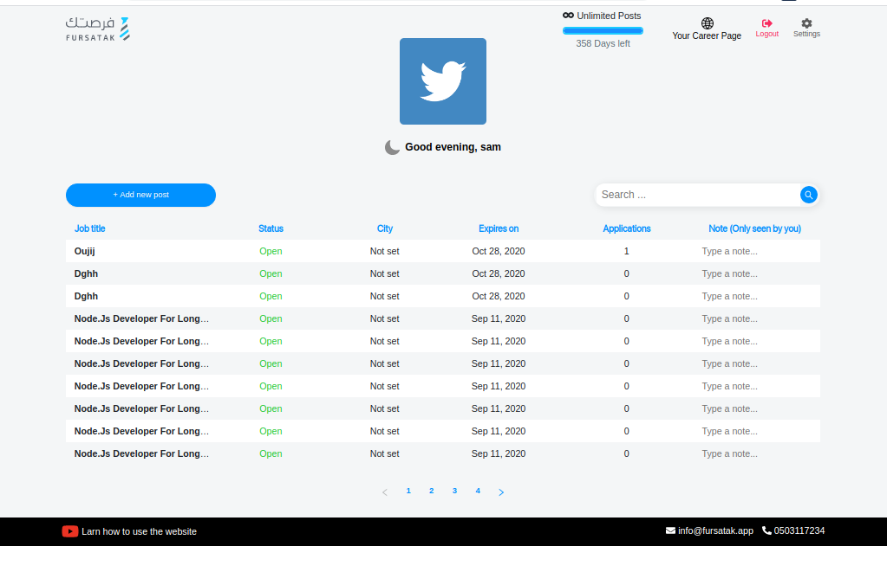
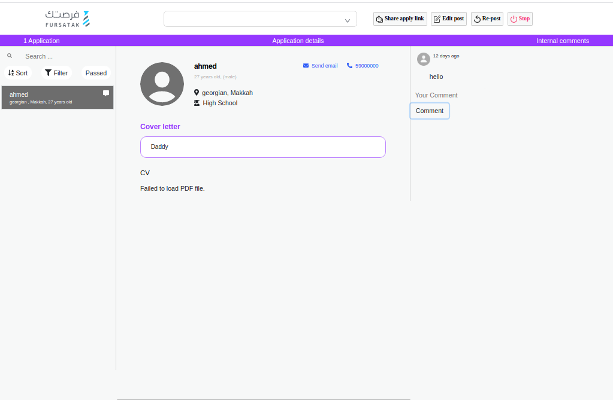
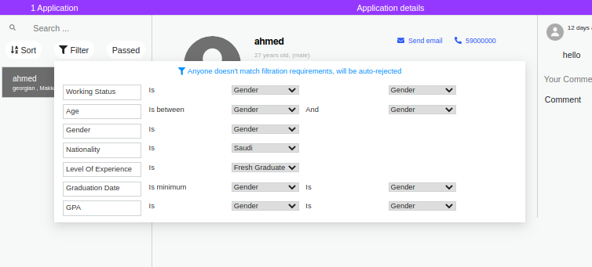
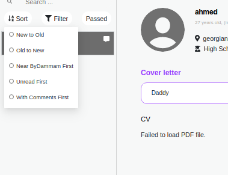

# Furstak
* This is a jobs Site that you can post a job as company or search for a job as user
* This site is developed in node.js(Express), mongoDB and React 

# Database Schema

### user Model
* active
* phone
* email
* password
* name
* gender
* birthday
* gpa_score
* avatar
* experience
* university_name
* major
* working_status
* graduation_year
* language
* study_location

### University Model
* name
* name

### Nationality Model
* (1) name

### Governorate Model
* name
* lan
* lon

### Region Model
* name

### Interested Model
* name

### GraduationStatus Model
* name

### Degree Model
* name

### GPA Model
* score

### FileCategory Model
* name

### File Model
* path
* description
* gender

### ActivationCodes Model
* email
* code

### Company Model
* type
* logo_path
* name
* website
* business_field
* employees
* description
* verified
* plan
* plan_started_at
* plan_finished_at

### Company User Model
* first_name
* last_name
* position
* mobile
* email
* password
* active
* admin
* blocked

### Address Model
* Address

### Iframe Model
* logo
* company_name
* description
* background_color
* text_color

### Notification Model
* job
* message
* date
* status

### Payment Model
* init_payment_id
* init_result_code
* init_result_descriotion
* init_build_number
* init_ndc
* amount
* type
* status

### Post Model
* general_type
* email
* link
* note
* title
* expected_hiring_date
* hrdf
* online
* salary
* experience
* description
* started_at
* finished_at
* active
* hr_video_enabled
* hr_evaluation_enabled
* hr_selection_enabled
* hr_nearby_enabled
* payment_type
* basic_filter_age
* basic_filter_gender
* basic_filter_natinality
* basic_filter_education
* basic_filter_university
* basic_filter_student_only

### Post User Model
* cover_letter
* attachments
* folder_name
* folder_type
* qualified
* isCommented
* isReaded

### Post Category Model
* name

### Comment Model
* body

### ChoosingQuiz Model
* question
* allow_multiple
* select_at_least_one
* select_all

### ChoosingQuizChoices Model
* answer
* is_correct

### CustomList Model
* name
* type

### DiscussionQuiz Model
* question

### EvaluationQuiz Model
* question
* min_rate

### Tool Model
* name
* description
* price

### Type Model
* name

### UserChoosingQuizChoices Model
* title

### UserDiscussionQuiz Model
* answer

### UserEvaluationQuiz Model
* choosed_score

### UserVideoQuiz Model
* video_path

### VideoQuiz Model
* question

#ـــــــــــــــــــــــــــ 

# You Can Do... 
### As Furstak Admin
* You can manage companies.
* You can manage posts.
* You can manage users.

### As Company
* Create, Edit, stop, and repost Posts.
* You can write note on the Post.
* Filter  and sort users on the post.
* You can write comment on the user that applied on the post.
* View all the currently available tables, along with the number of persons for each table.
* Reserve/Book a table.
* View the reservations/bookings for a specific date.

### As User
* You can create your profile
* you can upload your documents
* You can search for a job by (city or title)
* you can add a job to your favorite jobs
* you can remove the job from the favorite
* you can show your history 

## Install
* you must have nodejs on your machine and you can install it [nodejs](https://nodejs.org/en/download/).

## Run the Node project
* 1 ) Download the project Node.
* 2 ) Enter the Node project folder.
* 3 ) Run npm install from the command line to install package.json dependencies. 
* 4 ) Run 'npm migrate' to migrate database models
* 5 ) Run 'npm run dev' OR 'npm run serve' to start
* 6 ) the server will run on 8888 PORT.

## Run the React project
* 1 ) Download the project React.
* 2 ) Enter the React project folder.
* 3 ) Run 'yarn install' from the command line to install package.json dependencies. 
* 4 ) Run 'yarn install' to start
* 5 ) the server will run on 3000 PORT.

### photo of The Site

###### Home Page

###### all Jobs Page

###### Job Details Page

###### Filter Page

###### Sort Page

